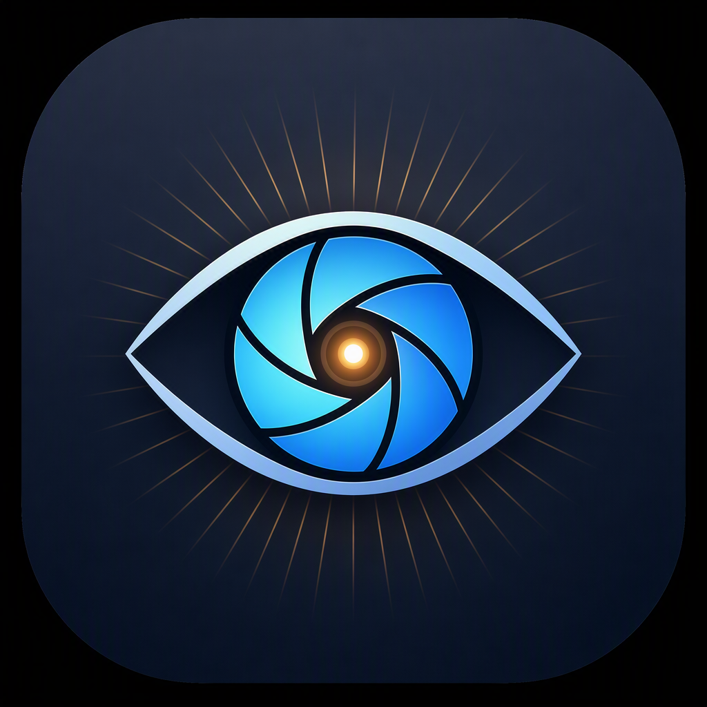

# LightSee 看图

<div align="center">
  
</div>

一款 Windows 原生桌面图片查看器，基于 **Qt 5.14.2**（msvc2017_64 / VS v143 工具链），界面风格对标现代看图软件：深色悬浮式工具栏 + 画布 + 可折叠缩略图侧栏。目标是"轻、快、够用"：秒开主流格式（含 HEIC），翻页/缩放/幻灯片等高频交互齐全，不做起步之外的编辑、截图等外围功能。

- 当前版本：**1.0.0**（单一来源 `src/version.h`，详见 [版本管理](#版本管理)）
- 平台：Windows x64（托盘、回收站、文件关联等依赖 Win32 API，不支持跨平台）
- 自动化质量门：`--selftest` 22 项检查，Release / Debug 双配置跑通

## 功能一览

### 格式支持

| 来源 | 格式 |
|---|---|
| Qt 自带 imageformats 插件 | PNG / JPG / JPEG / BMP / GIF（首帧）/ WEBP / TIFF / ICO / SVG |
| 仓内自研 `qheif` 插件 + 自构建 libheif/libde265 | HEIC / HEIF / HIF |

### 浏览

- 打开：`Ctrl+O` 文件对话框、拖拽文件或文件夹到窗口、命令行 `exe <图片或文件夹>`（文件夹解析为目录序第一张受支持图片）
- 翻页：键盘 `←→` / `A D`、鼠标侧键（Back/Forward），到边界循环环绕；缩略图侧栏点击跳转
- 幻灯片：`Space` 播放/暂停，间隔 1~10 秒右键可调，状态栏显示"▶ 播放中"
- 全屏：`F` / `F11`，`Esc` 退出

### 视图

- 滚轮以光标为中心缩放（5% ~ 800%）、`+` / `-` 步进缩放、`0` 适应窗口、`1` 原始尺寸、双击在 1:1 与适应间切换
- 左键拖拽平移；`L` / `R` 旋转、`H` / `V` 翻转
- 画布背景三档：深色 / 浅色 / 棋盘格（右键菜单切换，跨重启记住）

### 系统整合

- **回收站删除**：`Delete` 将当前图片移入回收站（弹确认框，默认 No；UNC/网络路径直接拒绝，防止静默永久删除），列表与缩略图栏自愈
- **系统托盘**：关窗收进托盘（双击托盘图标恢复窗口），托盘右键"退出"才真正退出进程
- **图片格式关联**：画布右键菜单"关联图片格式（写入系统）"，仅写 HKCU `OpenWithProgids`，出现在 Windows"打开方式"列表，**不抢占现有默认双击行为**
- **状态记忆**：窗口几何、侧栏开关与分栏宽度、背景档位、幻灯片间隔、上次打开目录均持久化（QSettings，详见[配置持久化](#配置持久化)）
- **预加载**：进入某目录后自动预解码相邻 2 张，翻页近乎无等待

## 工程结构

```
LightSee/
├── LightSee.sln                  # 主工程 + HeifPlugin 两个子工程
├── LightSee.vcxproj              # LightSee.exe（Qt VS Tools 工程，QtMsBuild）
├── build.cmd                     # msbuild 一键构建（vswhere 自动定位 MSBuild）
├── app.rc                        # VERSIONINFO + 内嵌图标（复用 src/version.h 宏）
├── resources.qrc                 # 图标 / dark.qss / light.qss
├── src/                          # 查看器源码（见下方模块职责表）
├── heif-plugin/                  # 自研 qheif：QImageIOPlugin + QImageIOHandler
├── third_party/
│   ├── libheif/                  # 自构建产物入库：include/ + bin/*.dll（x64）
│   ├── spdlog/                   # 日志库（header-only，随仓）
│   └── testdata/                 # selftest 样张（example.heic，像素门基准）
├── scripts/build-heif.ps1        # libde265 + libheif 源码构建脚本（仅首次/依赖变更）
├── docs/superpowers/             # 设计规格与实施计划
└── vibe_images/                  # 图标设计原稿
```

### 模块职责（src/）

| 文件 | 职责 |
|---|---|
| `MainWindow.h/.cpp` | 主窗口：工具栏/状态栏/侧栏装配、键盘鼠标事件、右键菜单、托盘、打开/翻页/幻灯片调度、状态存取 |
| `ImageView.h/.cpp` | `QGraphicsView` 画布：以光标为中心缩放、拖拽平移、旋转翻转、三档背景 `drawBackground` |
| `FolderModel.h/.cpp` | 目录图片列表：受支持扩展名白名单单一来源、目录序排列、上一张/下一张环绕 |
| `ThumbnailLoader.h/.cpp` | 缩略图异步加载：generation 计数丢弃过期结果，切目录 `cancel()` 不串图 |
| `PreloadCache.h` | 相邻图片预解码缓存（header-only），命中即秒显 |
| `SlideShowController.h/.cpp` | 幻灯片定时器封装（间隔可运行时修改） |
| `RecycleBin.h/.cpp` | `SHFileOperationW` 移入回收站；UNC 守卫；错误码→可读原因透传 |
| `FileAssoc.h/.cpp` | HKCU 文件关联：`LightSee.Image` ProgID + 各扩展 `OpenWithProgids`，原生 Win32 注册表 API（键名含点，QSettings 不可靠） |
| `Settings.h/.cpp` | QSettings 薄封装（`LightSee/LightSee` 组织/应用名） |
| `Log.h/.cpp` | spdlog 初始化：文件滚动 + 控制台双 sink |
| `SelfTest.h/.cpp` | `--selftest` 22 项自动化检查（解码像素门/翻页环绕/幻灯片/回收站守卫/预加载缓存） |
| `Viewer.ui` | Designer 主窗口布局（自定义控件以 promote 挂接） |
| `version.h` | 版本号唯一来源 |

## 关键设计

### HEIC 解码链路

```
Qt QImageReader → imageformats/qheif(.d).dll（QImageIOPlugin::create）
  → HeifHandler : QImageIOHandler（libheif C API）
    → heif.dll（libheif）→ libde265.dll（HEVC 解码）
```

- `read()`：`heif_read_from_memory` → 主图 handle → `heif_decode_image`，按通道（RGB24/YA8/RGBA32）转 `QImage`，并应用 `get_primary_rotation` 转正
- 后缀与 MIME 嗅探双通道声明（`heic/heif/hif` + `ftyp` box）
- **优雅降级**：插件缺失时其余格式不受影响，打开 HEIC 弹"无法解码 HEIC"并提示部署缺哪个文件
- 产物 DLL 全部入库，日常构建不触发 CMake；post-build 自动拷贝到 exe 目录

### 缩略图与预加载的一致性

切目录/翻页时 `ThumbnailLoader::populate` 重建列表并用 generation 号丢弃迟到的异步结果；`PreloadCache` 只缓存当前目录相邻 2 张，删除图片后列表与缓存同步失效。

### 删除安全

回收站操作前先做路径守卫：网络路径（`\\server\share`、含 `\\?\` 扩展前缀）一律拒绝并说明原因——这类路径 `SHFileOperationW` 不进回收站，会静默永久删除。

## 环境要求

| 依赖 | 说明 |
|---|---|
| Visual Studio 2022 | v143 工具集（vswhere 自动定位 MSBuild） |
| Qt 5.14.2 msvc2017_64 | 需安装 [Qt VS Tools] 扩展并在其中注册该 Qt 版本（工程 `QtInstall=5.14.2_msvc2017_64`） |
| Qt 模块 | core / gui / widgets / concurrent；imageformats 插件随 Qt 部署 |
| CMake | 仅 `scripts/build-heif.ps1` 重编 libheif 时需要（日常不需要） |

## 构建

### 1. HEIC 依赖（仅首次或依赖变更时；产物已入库，日常无需执行）

```powershell
powershell -ExecutionPolicy Bypass -File scripts\build-heif.ps1
```

产物落 `third_party\libheif\{include,bin,lib}`（x64）。

> ⚠️ **libde265 Release 必须保持 `/O1`（勿改回 `/O2`）**：MSVC 14.51（VS18）在默认 `/O2` 下会错误编译 libde265 1.0.15 —— `heif_decode_image` 返回成功但输出绿块/马赛克噪声。`/O1` 是误编译规避，不是降画质；`--selftest` 的像素门（greenFrac/方差/色彩数）会拦住回归。

### 2. 主工程 + 插件

```cmd
build.cmd Release
build.cmd Debug
```

整解决方案（LightSee.exe + HeifPlugin/qheif(.d).dll）一次构建；post-build 自动把 `qheif(.d).dll` 拷入 exe 目录 `imageformats\`、`heif.dll`/`libde265.dll` 拷入 exe 目录。

## 运行与自检

```cmd
x64\Release\LightSee.exe [图片或文件夹路径]
x64\Release\LightSee.exe --selftest   :: 22 项自动化检查，全 PASS 退出码 0
```

开发机 Qt bin 在 PATH 时可直接跑；干净机器请按下面部署。

## 打包部署（干净机器）

```cmd
windeployqt --release --dir dist x64\Release\LightSee.exe
```

然后**手工补拷 3 个 HEIC 文件**（windeployqt 不认识自研插件）：

1. `x64\Release\imageformats\qheif.dll` → `dist\imageformats\qheif.dll`
2. `x64\Release\heif.dll` → `dist\heif.dll`
3. `x64\Release\libde265.dll` → `dist\libde265.dll`

已实测：按上述配方得到的 dist 目录在无 Qt PATH 的环境下 `--selftest` 22/22 PASS（含 HEIC 解码像素门）。
Debug 配置的 `qheifd.dll` 由 build.cmd post-build 部署到 `x64\Debug\imageformats\`（selftest 双配置验证 HEIC 链路），但未做 `windeployqt --debug` 验证。

## 配置持久化

QSettings（`组织=LightSee`，`应用=LightSee`）落在注册表 **`HKCU\Software\LightSee\LightSee`**：

| 键 | 类型 | 含义 |
|---|---|---|
| `win/geometry` | QByteArray | `saveGeometry()` 窗口位置/尺寸 |
| `win/lastDir` | QString | 上次打开所在目录（`Ctrl+O` 默认位置） |
| `view/thumbPanel` | bool | 缩略图侧栏开关 |
| `view/thumbSplit` | QByteArray | 主/侧栏分栏宽度 |
| `view/bgMode` | int | 画布背景：0 深色 / 1 浅色 / 2 棋盘格 |
| `slide/intervalMs` | int | 幻灯片间隔，默认 3000 |

文件关联写的是系统位置（非 QSettings）：`HKCU\Software\Classes\LightSee.Image`（ProgID，显示名"LightSee 看图"，图标取 exe 内资源）+ 各扩展名（png/jpg/jpeg/bmp/gif/webp/heic）`OpenWithProgids` 追加值。全部 HKCU、免管理员、幂等覆盖写。

## 日志

exe 目录下 `logs\lightsee.log`（spdlog 滚动：单文件 5MB × 3 份，另有控制台 sink）。首行为版本号，便于对账；删除/解码失败等错误原因都会落盘。

## 使用说明（键盘 / 鼠标）

按键与 `src/MainWindow.cpp::keyPressEvent` 逐项核对：

| 按键 / 操作 | 功能 |
|---|---|
| `A` / `D` | 上一张 / 下一张（循环） |
| `←` / `→` | 上一张 / 下一张（循环；画布 NoFocus 后直达主窗口，见验收记录） |
| `+` / `-` | 放大 / 缩小 |
| `0` / `1` | 适应窗口 / 1:1 |
| `L` / `R` | 左旋 / 右旋 |
| `H` / `V` | 水平 / 垂直翻转 |
| `Space` | 幻灯片播放 / 暂停（状态栏出现 "▶ 播放中"） |
| `F` / `F11` | 进入 / 退出全屏；`Esc` 仅在全屏时生效 |
| `Delete` | 当前图片移入回收站（弹确认框，默认 No） |
| `Ctrl+O` | 打开文件对话框（QAction 快捷键，焦点在任意控件都生效） |
| 滚轮 | 以光标为中心缩放 |
| 左键拖拽 / 双击 | 平移 / 1:1 与适应切换 |
| 鼠标侧键 Back / Forward | 上一张 / 下一张 |
| 右键画布 | 菜单：画布背景三档、幻灯片间隔 1~10 秒、关联图片格式（写入系统）、关于 LightSee |
| 拖入文件/文件夹 | 文件直接打开；文件夹打开其中目录序第一张受支持图片（无图则状态栏提示"无法打开"）。CLI 参数 `exe <路径>` 同此语义 |
| 关闭按钮 `×` | 收进系统托盘（双击托盘图标恢复）；托盘右键"退出"才真正退出 |

## 版本管理

- 单一来源：`src/version.h`。exe 属性页的 VERSIONINFO（`app.rc` 复用同一组宏）、启动日志首行、画布右键"关于 LightSee"都取这里。
- 语义化 `MAJOR.MINOR.PATCH`：不兼容变更进 MAJOR，新增功能进 MINOR，缺陷修复进 PATCH。
- 升版步骤：改 `src/version.h` → 重新生成解决方案（RC 增量只盯 `app.rc`，单改头文件不会重编资源）→ 提交 → `git tag -a v1.0.0 -m "LightSee 1.0.0"` → `git push origin v1.0.0`。

## 故障排查

| 现象 | 原因 / 处置 |
|---|---|
| 打开 HEIC 弹"无法解码 HEIC" | `imageformats\qheif.dll`（Release 为 `qheif.dll`，Debug 为 `qheifd.dll`）或 `heif.dll`/`libde265.dll` 未拷到 exe 目录，见[打包部署](#打包部署干净机器) |
| HEIC 解出绿块/马赛克，但接口返回成功 | libde265 被以 `/O2` 重编触发的 MSVC 误编译，按[构建 §1](#1-heic-依赖仅首次或依赖变更时产物已入库日常无需执行) 用 `/O1` 重建；`--selftest` 像素门会复现 |
| 双击 exe 报找不到 Qt5DLL / platform plugin | 未经 `windeployqt` 部署且 Qt bin 不在 PATH |
| 改完 `version.h` 关于对话框/属性页版本没变 | RC 增量只盯 `app.rc`，需"重新生成解决方案" |
| `Delete` 提示不支持网络路径 | 设计如此：UNC 删除不进回收站，防静默永久删除；先复制到本地再删 |
| 关"×"后进程还在 | 设计如此：收进托盘；托盘右键"退出"才真退 |

## 开发约定

- UI 信号槽一律显式 `connect()`，不用 `on_<object>_<signal>` 自动连接；布局与控件定义放 `Viewer.ui`，代码只做装配与逻辑
- 目标 API 是 Qt **5.14**：勿引入 Qt6-only API（如 `QSplitter::handleSize` 一类变更需查证）
- Win32 交互注意：`SHFileOperationW`/`SHChangeNotify` 声明在 `shlobj.h`；含点的注册表键路径用原生 `RegCreateKeyExW` 而非 QSettings；`QString` 与 `L""` 字面量不可混拼
- 改动的实跑验证回路：杀进程 → `build.cmd` → `--selftest` → 起 GUI 截屏目检；合成输入（wheel/drag/hover）与真机有差异，涉及此类交互需人工确认

## 已知限制

- GIF 仅显示首帧；AVIF 不支持（spec §9 范围外）。
- 棋盘格背景按场景坐标平铺（Qt 5.14 `drawBackground` 固有行为）：格子随缩放放大、随旋转转动。
- 放大状态下旋转后视口可能停在空白区（rotateBy 未重跑 fit），按 `0` 恢复。
- `\\?\` 扩展长度路径会被回收站守卫当 UNC 拒绝（优雅失败）。
- 编辑、截图、设壁纸、EXIF 完整面板、批量转换均不在当前版本范围（spec §9；文件关联已于后续版本实现）。
- Debug 配置未做 `windeployqt --debug` 打包验证。

> final-fix pass 已修复并从本清单移除：←/→ 方向键翻页（画布设 NoFocus）、鼠标侧键翻页、`Ctrl+O`、拖拽/CLI 打开文件夹、不存在路径的提示、keyPressEvent 修饰键过滤、删除失败文案"错误码"→"原因"。

## 验收记录（spec §8 冒烟清单，2026-09-20，Task 9）

构建门：`build.cmd Release`、`build.cmd Debug` 均 0 error；`--selftest` Release 22 PASS / EXIT=0，Debug 22 PASS / EXIT=0，两配置输出逐行一致。

| # | 项 | 状态 | 证据 / 方法 |
|---|---|---|---|
| 1 | 九类主流格式 + HEIC 各一张打开正常 | ✅ 机验 | GUI 启动 + EnumWindows 标题 + PrintWindow 截图，10/10 渲染正确：`evidence/task9-formats-01.png` … `task9-formats-10.heic.png` |
| 2a | 翻页环绕 | ✅ 机验 | 第 10 张按 `D` 回到 `01.png (1/10)`；selftest "folder: next/prev wrap"。⚠️ 但方向键 `←/→` 被画布吞（见已知限制与 `task9-arrowkey-blocked.png`），机验用 `A/D` |
| 2b | 缩略图栏点击跳转 | ✅ 机验 | 合成 WM_LBUTTONDOWN 点击第 4 张缩略图 → 标题 `04.bmp (4/10)`：`evidence/task9-thumb-click.png` |
| 2c | 幻灯片播放 | ✅ 机验 | Space 开启自动翻页（标题 2/10→3/10）、"▶ 播放中" + 按钮蓝色按下态：`evidence/task9-slide-playing.png`；Space 停止后标题 3s 内不再变化 |
| 3a | 缩放/旋转/翻转无渲染错误 | ✅ 机验 | `1`/`+`×3 → 195%（`task9-zoom-195.png`）；`L`+`H` 变换正确（`task9-rotate-flip.png`）；`0` 恢复适应 |
| 3b | 全屏 | ✅ 机验 | `F` → 1920×1080 无边框（`task9-fullscreen.png`）；`Esc` → 恢复 1116×739 |
| 3c | 滚轮以光标为中心缩放 | ⚠️ 人工 | 合成 WM_MOUSEWHEEL 被 Qt 按真实光标位置路由、注入无效。人工方法：放大一张大图 → 指针停在图像一侧滚动滚轮，缩放中心应跟随指针 |
| 3d | 左键拖拽平移 | ⚠️ 人工 | 需真实鼠标拖拽。方法：1:1 打开大图，按住左键拖动画布应平移 |
| 3e | 工具栏 hover 高亮 | ⚠️ 人工 | 合成 WM_MOUSEMOVE 不触发 QSS :hover。方法：鼠标悬停工具栏按钮，应出现 #34363c 底色（checked 蓝态已由 2c 截图机验） |
| 4 | 删除进回收站 + 列表自愈 | ✅ 机验 | Delete → 确认框（`task9-delete-dialog.png`）→ 按 Y → 文件真实离开目录、标题 `del2.png (1/1)`、状态栏"已移入回收站"（`task9-after-delete.png`）；另有 selftest recyclebin 6 项（UNC 守卫/长路径/rc 透传） |
| 5 | 重开 exe 记住窗口位置与侧栏状态 | ✅ 机验 | Task 7：closeEvent 写注册表 `win/geometry`、`view/thumbPanel`，重启同位同尺寸 + 侧栏自动展开（`task7-checker-restored.png`）；本次复验：`view/bgMode=1` 跨重启生效 + 侧栏预置 `thumbPanel=true` 自动展开（`task9-thumb-click.png`） |
| 6 | 拔掉 qheif.dll → 其余格式正常、HEIC 明确提示 | ✅ 机验 | Task 6：改名 qheif.dll → selftest FAIL；GUI 弹"无法解码 HEIC"对话框，PNG 正常打开（task-6-report 部署完整性实测一节） |
| 7 | 右键菜单背景三档 | ✅ 机验 | 合成右键弹菜单（`task9-context-menu.png`）+ 键盘导航选"浅色"→ 注册表 `view/bgMode=1` + 截图浅色生效（`task9-bg-light.png`） |
| 8 | 右键菜单幻灯片间隔 | ⚠️ 人工 | 间隔子菜单合成按键两次未命中（同一 `onCanvasMenu` 处理器，背景分支已机验）。方法：右键画布 → 幻灯片间隔 → 选 N 秒，播放节奏应改变 |
| — | 全量 selftest（最终完成点） | ✅ | Release/Debug 各 22 PASS、EXIT=0、输出逐行一致（heic 像素门 greenFrac=0.000 variance=5130.2） |

汇总：机验 9 项 + 构建/selftest 2 项；⚠️ 人工 4 项（滚轮缩放中心、拖拽平移、hover 态、间隔子菜单），均为输入注入手段受限而非功能缺陷；1 个真实缺陷（方向键翻页被画布吞）已列入已知限制。

### final-fix pass 验收补充（2026-09-20）

构建门（修复后重跑）：`build.cmd Release`、`build.cmd Debug` 均 0 error；两配置 `--selftest` 各 22 PASS / EXIT=0，输出逐行一致。

| 项 | 状态 | 验证方法 |
|---|---|---|
| `←`/`→` 方向键翻页 | ✅ 机验 | Viewer.ui 给 canvas 设 `Qt::NoFocus` 后，向**本进程自启窗口** hwnd PostMessage `WM_KEYDOWN/UP`(VK_RIGHT/VK_LEFT)：标题 `img1.png (1/2)` → `(2/2)` → `(1/2)`；`A` 键对照组同步通过 |
| 鼠标侧键 = 上一/下一张 | ✅ 机验 | PostMessage `WM_XBUTTONDOWN/UP`（wParam=MK_XBUTTON2/MK_XBUTTON1，即 Qt 的 Forward/Back）到画布区域：`(1/2)` →`(2/2)`→ `(1/2)` |
| 文件夹打开（CLI/拖拽） | ✅ 机验(CLI) | `%TEMP%\lightsee_t9fix_dir`（img1.png、img2.png + 1 个 .txt 噪声）以目录为 CLI 参数启动 → 标题 `img1.png (1/2)`，txt 被正确过滤。拖拽走 `dropEvent`→`openFile` 同一分支（含 `firstSupportedFile` 目录解析），代码走查确认，真实 shell 拖放为人工场景 |
| 不存在/无图路径提示 + 空态 | ✅ 机验(状态) + 文案走查 | 不存在的目录参数启动：进程不崩、标题保持默认"LightSee 看图"（空态、动作禁用）。提示文本 "无法打开：%1" 在 `MainWindow::openFile` 单一分支内（状态栏文本无 API 可取，属代码走查项） |
| `Ctrl+O` | ✅ 机验 | SetForegroundWindow(自启 pid 主窗) 校验通过后 keybd_event 注入：出现新前台窗口，类名 `#32770`（Win32 打开对话框）、标题"打开图片"；Esc 关闭后应用正常 |
| keyPressEvent 修饰键过滤 | ✅ 机验 | 真实 Ctrl(down)+→ 注入：标题不变（不再误触发翻页）；松开 Ctrl 后单独 → 恢复翻页。非目标窗口零注入（每步先验证 GetForegroundWindow==自启 hwnd） |
